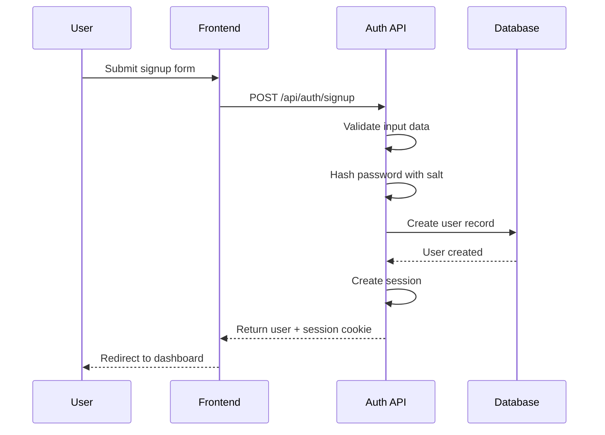
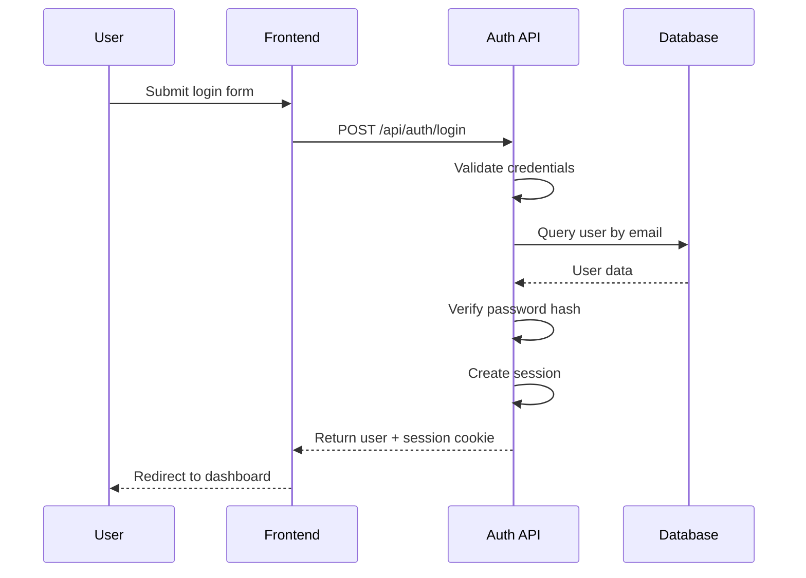
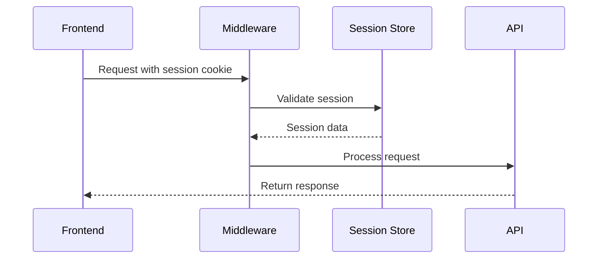

# Authentication & Authorization

## Overview

The Mildenberg Project Platform uses a session-based authentication system with role-based access control (RBAC). The system provides secure user authentication, session management, and granular permissions.

## Authentication Flow

### 1. User Registration


### 2. User Login


### 3. Session Validation


## Security Features

### Password Security
- **Hashing Algorithm**: bcrypt-style hashing
- **Salt Generation**: Unique salt per password
- **Minimum Requirements**: 8+ characters (configurable)

```typescript
// Password hashing implementation
export async function hashPassword(password: string): Promise<string> {
  const salt = await bcrypt.genSalt(12)
  return bcrypt.hash(password, salt)
}

export async function verifyPassword(password: string, hash: string): Promise<boolean> {
  return bcrypt.compare(password, hash)
}
```

### Session Security
- **HTTP-Only Cookies**: Prevents XSS attacks
- **Secure Flag**: HTTPS only in production
- **SameSite**: CSRF protection
- **Expiration**: Configurable session timeout

```typescript
// Session configuration
const sessionConfig = {
  name: 'mildenberg-session',
  httpOnly: true,
  secure: process.env.NODE_ENV === 'production',
  sameSite: 'lax' as const,
  maxAge: 7 * 24 * 60 * 60 * 1000, // 7 days
}
```

## User Roles & Permissions

### Role Hierarchy
```
Admin
├── Full system access
├── User management
├── Project management
├── Task management
├── Client management
└── System administration

User
├── Own projects
├── Assigned tasks
├── Client viewing
└── Team viewing
```

### Permission Matrix

| Resource | Admin | User |
|----------|-------|------|
| View Projects | ✅ All | ✅ Own + Assigned |
| Create Projects | ✅ | ✅ |
| Edit Projects | ✅ All | ✅ Own |
| Delete Projects | ✅ | ❌ |
| View Tasks | ✅ All | ✅ Own + Assigned |
| Create Tasks | ✅ | ✅ |
| Edit Tasks | ✅ All | ✅ Own |
| Delete Tasks | ✅ | ❌ |
| View Users | ✅ All | ✅ Team |
| Edit Users | ✅ | ❌ |
| Delete Users | ✅ | ❌ |
| View Clients | ✅ All | ✅ All |
| Create Clients | ✅ | ✅ |
| Edit Clients | ✅ | ✅ |
| Delete Clients | ✅ | ❌ |
| Admin Panel | ✅ | ❌ |

## Implementation Details

### Session Management

#### Session Creation
```typescript
export async function createSession(userId: number): Promise<string> {
  const sessionId = crypto.randomUUID()
  const expiresAt = new Date(Date.now() + 7 * 24 * 60 * 60 * 1000)
  
  await redis.setex(
    `session:${sessionId}`,
    7 * 24 * 60 * 60, // 7 days in seconds
    JSON.stringify({
      userId,
      expiresAt: expiresAt.toISOString()
    })
  )
  
  return sessionId
}
```

#### Session Validation
```typescript
export async function validateSession(sessionId: string): Promise<SessionData | null> {
  const sessionData = await redis.get(`session:${sessionId}`)
  
  if (!sessionData) {
    return null
  }
  
  const session = JSON.parse(sessionData)
  
  if (new Date(session.expiresAt) < new Date()) {
    await redis.del(`session:${sessionId}`)
    return null
  }
  
  return session
}
```

### Middleware Protection

#### Route Protection
```typescript
// pages/api/protected-route.ts
export default async function handler(req: NextApiRequest, res: NextApiResponse) {
  const session = await getSession(req)
  
  if (!session) {
    return res.status(401).json({ error: 'Unauthorized' })
  }
  
  // Process protected request
}
```

#### Role-Based Protection
```typescript
// pages/api/admin-route.ts
export default async function handler(req: NextApiRequest, res: NextApiResponse) {
  const user = await getCurrentUser(req)
  
  if (!user || user.role !== 'admin') {
    return res.status(403).json({ error: 'Forbidden' })
  }
  
  // Process admin request
}
```

## Authentication Components

### Login Form
- Email/password validation
- Error handling
- Loading states
- Remember me option

### Signup Form
- Email validation
- Password strength indicator
- Terms acceptance
- Email verification (optional)

### User Status Component
- Current user display
- Logout functionality
- Role indicators
- Profile link

## Security Best Practices

### Input Validation
```typescript
// Zod schema for user input
const loginSchema = z.object({
  email: z.string().email('Invalid email address'),
  password: z.string().min(8, 'Password must be at least 8 characters')
})

const signupSchema = z.object({
  email: z.string().email('Invalid email address'),
  password: z.string()
    .min(8, 'Password must be at least 8 characters')
    .regex(/^(?=.*[a-z])(?=.*[A-Z])(?=.*\d)/, 'Password must contain uppercase, lowercase, and number'),
  name: z.string().min(2, 'Name must be at least 2 characters')
})
```

### Rate Limiting
```typescript
// Login attempt limiting
const loginAttempts = new Map<string, { count: number; lastAttempt: number }>()

export function checkLoginRateLimit(ip: string): boolean {
  const attempts = loginAttempts.get(ip)
  const now = Date.now()
  
  if (!attempts) {
    loginAttempts.set(ip, { count: 1, lastAttempt: now })
    return true
  }
  
  // Reset after 15 minutes
  if (now - attempts.lastAttempt > 15 * 60 * 1000) {
    loginAttempts.set(ip, { count: 1, lastAttempt: now })
    return true
  }
  
  // Allow 5 attempts per 15 minutes
  if (attempts.count >= 5) {
    return false
  }
  
  attempts.count++
  attempts.lastAttempt = now
  return true
}
```

### CSRF Protection
- SameSite cookie attribute
- CSRF tokens for state-changing operations
- Origin header validation

### XSS Protection
- Input sanitization
- Output encoding
- Content Security Policy headers

## Session Storage

### Redis Configuration
```typescript
const redis = new Redis({
  host: process.env.REDIS_HOST || 'localhost',
  port: parseInt(process.env.REDIS_PORT || '6379'),
  password: process.env.REDIS_PASSWORD,
  db: 0,
  retryDelayOnFailover: 100,
  maxRetriesPerRequest: 3
})
```

### Session Cleanup
```typescript
// Cleanup expired sessions
setInterval(async () => {
  const keys = await redis.keys('session:*')
  const now = Date.now()
  
  for (const key of keys) {
    const sessionData = await redis.get(key)
    if (sessionData) {
      const session = JSON.parse(sessionData)
      if (new Date(session.expiresAt) < new Date()) {
        await redis.del(key)
      }
    }
  }
}, 60 * 60 * 1000) // Run every hour
```

## Error Handling

### Authentication Errors
- `INVALID_CREDENTIALS`: Wrong email/password
- `ACCOUNT_LOCKED`: Too many failed attempts
- `SESSION_EXPIRED`: Session has expired
- `INVALID_SESSION`: Malformed session data

### Authorization Errors
- `INSUFFICIENT_PERMISSIONS`: User lacks required role
- `RESOURCE_NOT_FOUND`: Requested resource doesn't exist
- `ACCESS_DENIED`: User cannot access specific resource

## Testing Authentication

### Unit Tests
```typescript
describe('Authentication', () => {
  test('should hash password correctly', async () => {
    const password = 'testpassword123'
    const hash = await hashPassword(password)
    expect(await verifyPassword(password, hash)).toBe(true)
  })
  
  test('should create valid session', async () => {
    const userId = 1
    const sessionId = await createSession(userId)
    const session = await validateSession(sessionId)
    expect(session?.userId).toBe(userId)
  })
})
```

### Integration Tests
```typescript
describe('Login Flow', () => {
  test('should login with valid credentials', async () => {
    const response = await request(app)
      .post('/api/auth/login')
      .send({ email: 'test@example.com', password: 'password123' })
      .expect(200)
    
    expect(response.body.user).toBeDefined()
    expect(response.headers['set-cookie']).toBeDefined()
  })
})
```

## Troubleshooting

### Common Issues

1. **Session Not Persisting**
   - Check cookie settings
   - Verify Redis connection
   - Check domain/subdomain configuration

2. **Login Failures**
   - Verify password hashing
   - Check user exists in database
   - Validate input data

3. **Permission Errors**
   - Check user role assignment
   - Verify middleware configuration
   - Review permission logic

### Debug Tools
```typescript
// Session debugging
export async function debugSession(sessionId: string) {
  const sessionData = await redis.get(`session:${sessionId}`)
  console.log('Session data:', sessionData)
  
  const user = await getUserById(JSON.parse(sessionData).userId)
  console.log('User data:', user)
}
```


